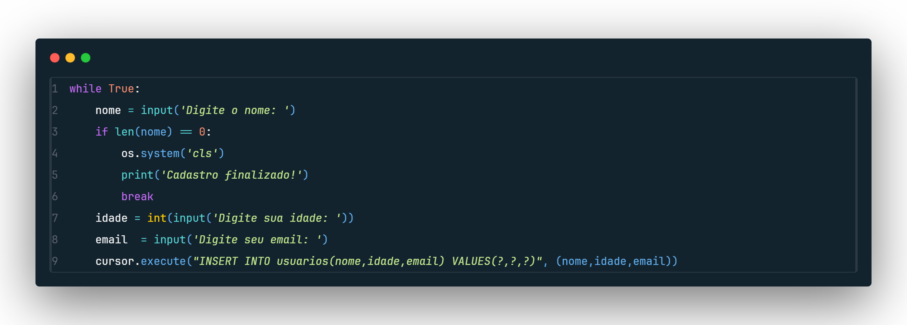

# Projeto_cadastro_de_Usuario
Desafio proposto para criar habilidades com SQL e praticar Python / Lógica
# IDEIA DO PROJETO
A ideia inicial do projeto é pegar os fundamentos de criação e interação de Bancos de Dados com o usuario!
Para inicio, seguindo o o proposto, fiz uma base para que o usuario cadastre quantos usuarios quiser, o ponto que interrompe o projeto é a falta de nome do usuario que finaliza o loooping While
</img>